<!-- 아이디(rmdkdkr-png)가 이미 채워져 있습니다. 고칠 곳 없습니다.
     Settings → Pages → Source: Deploy from a branch → main / (root) 로 켜면
     https://<아이디>.github.io/ss2-sp-runner/ 에서 바로 실행됩니다. -->

<div align="center">

# 버튼 하나 = 필살기

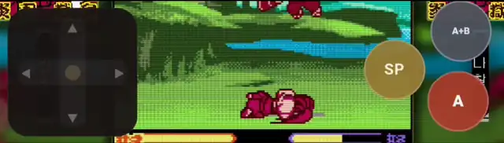

**네오지오 포켓 컬러 『사무라이 스피리츠! 2』를 브라우저에서.
↓↘→＋A 같은 커맨드는 몰라도 됩니다.**

### [▶ 지금 실행](https://rmdkdkr-png.github.io/ss2-sp-runner/) — 설치 없음, 자기 롬만 고르면 끝

[사용설명서](https://rmdkdkr-png.github.io/ss2-sp-runner/docs/manual.html) &nbsp;·&nbsp; [📱 안드로이드 앱판](https://rmdkdkr-png.github.io/ss2-sp-runner/app.html) &nbsp;·&nbsp; [변경 이력](CHANGELOG.md)

`HTML 한 장` · `설치 없음` · `롬 미포함` · `홈 화면 설치 가능` · `v0.5.9`

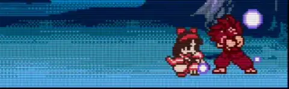
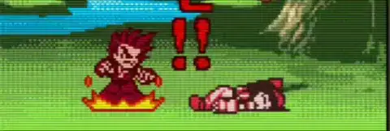

**해설이 붙습니다 — 화자마다 다른 말을 합니다**

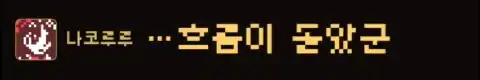
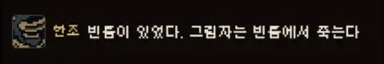
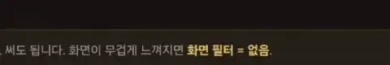
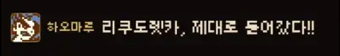

<a href="https://rmdkdkr-png.github.io/ss2-sp-runner/docs/clips/sideart.webp">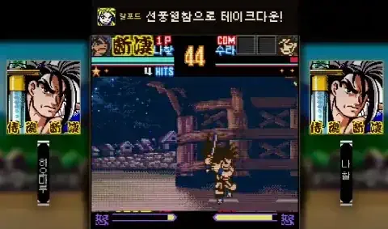</a>
<a href="https://rmdkdkr-png.github.io/ss2-sp-runner/docs/clips/combo.webp">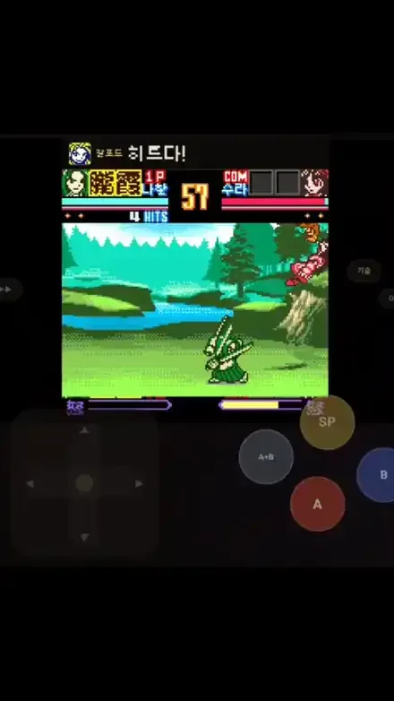</a>

*↑ 전부 실기 화면입니다. 클릭하면 영상이 열립니다*

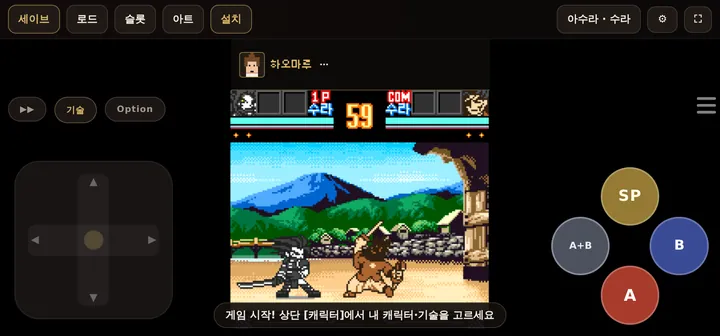
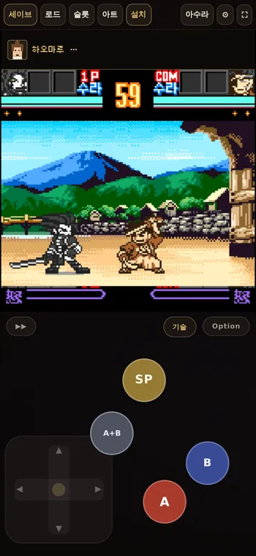
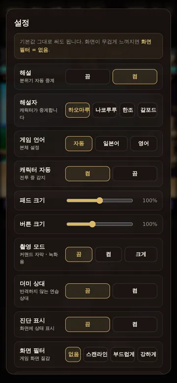

*↑ 가로 · 세로 기본 배치와 설정 — 전부 기본값 그대로입니다*

</div>

---

> 게임 자체의 입력 결함과 플레이어인 저의 손 결함에 대해
> **모던 모드**를 만들어보고자 하였던 몸부림입니다.

NGPC판 『사무라이 스피리츠! 2』는 커맨드 판정이 유난히 인색합니다.
십자키 하나로 `623`을 정확히 넣는 것도 어렵지만, 게임의 커맨드 매처가
**직전 입력 잔재를 물고 늘어져 엉뚱한 기술을 내보내는** 문제가 따로 있습니다.

이 실행기는 그 두 가지를 다 우회합니다. **SP 버튼 한 번**이면 필살기가 나가고,
캐릭터가 보는 방향은 게임 메모리에서 읽어 **커맨드를 자동으로 좌우 반전**합니다.
좌우 전환 스위치 같은 건 없습니다 — 신경 쓸 필요가 없으니까요.

---

## 쓰는 법

1. 위의 **[▶ 바로 실행하기]** 를 누릅니다. (또는 `index.html`을 내려받아 브라우저로 열기)
2. 본인이 소유한 **롬 파일(`.ngc`)** 을 끌어다 놓습니다.
3. 바로 실행됩니다. 롬은 브라우저 안에만 저장되므로 다음부터는 `▶ 바로 시작`.
4. 상단 **[캐릭터]** 에서 내 캐릭터·유파(수라/나찰)를 맞춥니다.

> **롬은 포함되어 있지 않습니다.** 본인이 정당하게 소유한 파일을 사용하세요.
> 에뮬레이터 본체를 CDN에서 받아오므로 **첫 실행에는 인터넷 연결이 필요**합니다.

## 조작

| 버튼 | 하는 일 |
|---|---|
| **SP** | 필살기. **디패드를 어느 쪽으로 누르고 있느냐**에 따라 7자리(중립·앞·아래·뒤·↘·↙·공중)로 갈립니다 |
| **A / B** | 게임 원래의 베기 / 발차기. 8프레임 넘게 누르면 **강** (버튼 색이 바뀝니다) |
| **A+B** | 분노 폭발 |
| **뒤 + A+B** | **비오의** |
| **기술** | 기술 목록. 탭하면 즉시 발동 |
| **▶▶** | 3배속 빨리감기 |

버튼은 이 넷이 전부입니다 — **A · B · A+B · SP**. 나머지 기술은 전부 SP+방향으로 나갑니다.
SP를 눌렀는데 그 자리가 비어 있으면 그냥 베기가 나가고, 카드가 있어야 하는 기술이면
왜 안 나갔는지 알려 줍니다.

## 기능

- **SP 7자리 배치** — [캐릭터] 시트에서 자리마다 원하는 기술을 직접 배정
- **🔎 점검** — 각 자리를 실제로 발동시켜 의도한 기술이 나오는지 확인
- **캐릭터 자동 감지** — 전투 중 [👤 자동] 한 번이면 현재 캐릭터로 맞춤
- **세이브** — 퀵 1칸 + 이름 슬롯 3칸, 게임 내 카드 저장은 자동 보관
- **전 버튼 드래그 배치** + 크기·투명도 조절
- **화면 필터** — 없음 / 스캔라인 / 부드럽게 / 강하게
- **캐릭터 해설** — 게임 메모리를 읽어 46가지 사건을 알아채고 화면 위 띠에 한 마디씩.
  화자는 **하오마루 · 나코루루 · 한조 · 갈포드** 넷 중에 고릅니다. 같은 사건도 화자마다 말이 다릅니다 —
  역전이면 하오마루는 "오오, 판이 뒤집혔다!!", 한조는 "…형세 역전". 기본은 켬
- **홈 화면 설치 (PWA)** — 상단 [설치] 버튼. 주소창 없이 전체화면으로 뜨고 **오프라인으로도 돕니다**
- **양옆 아트웍** — 세로 화면이 남기는 빈 자리를 스테이지 배경과 **카드 그림**으로 채웁니다.
  이름판은 게임이 그린 글자를 그대로 떠 옵니다. 🎴 버튼으로 후보를 돌립니다
- **더미 상대** — 반격하지 않는 연습 상대. 한 번 뒤로 물러나 구석에 선 뒤로는 움직이지 않고, 쓰러지지도 않습니다.
  시연 클립을 찍거나 커맨드를 익힐 때 씁니다. 기본은 끔
- **촬영 모드** — 녹화·스샷용 자막. 기술이 나갈 때 화면 아래에
  「← + SP ▶ ↓ ↘ → ＋ A · 나바이베루」처럼 **한 버튼이 무슨 커맨드로 풀리는지**를 큼직하게 깝니다.
  글자에 불이 들어오는 시점이 실제 입력 시점이고, 자막 위치는 [버튼 배치] 편집에서 버튼과 같이 끌어서 옮깁니다. 기본은 끔
- **성능 측정** — 설정 맨 아래 [측정 시작]. 16초 동안 에뮬 fps·프레임 간격·끊김을 재서
  브라우저끼리 숫자로 비교할 수 있습니다

---

## 어떻게 동작하나

<table>
<tr><td width="34%"><b>커맨드 대행</b></td>
<td>기술을 <code>[{방향, 버튼, 유지프레임}]</code> 스텝 배열로 컴파일해 에뮬레이터 패드에 밀어 넣습니다.
진행 기준은 <code>requestAnimationFrame</code>이 아니라 <b>에뮬레이터의 실제 프레임 카운터</b>(<code>getFrameNum()</code>)입니다.
화면 FPS가 떨어져도 입력 프레임이 흔들리지 않습니다.</td></tr>
<tr><td><b>방향 자동 미러링</b></td>
<td>게임 RAM의 FACING 값을 읽어 커맨드 좌우를 뒤집습니다.</td></tr>
<tr><td><b>입력 히스토리 리셋</b></td>
<td>커맨드를 넣기 직전 RAM에 <b>1바이트</b>를 씁니다. 그러면 게임이 <i>자기 자신의</i> 리셋 경로로
입력 링 커서를 정리합니다 — 잔재가 새 커맨드를 가로채지 못하게. 추가 지연 <b>0프레임</b>.<br>
<sub>실측: 하이재킹 7종 × 6회 → 무보정 0/42, 리셋 적용 <b>41/42</b>. 3연참도 3/3 무손상.</sub></td></tr>
</table>

---

## 성능 — 터치하면 끊기던 이유

배포 직전까지 **손가락이 화면에 닿는 동안 프레임이 떨어지는** 문제가 남아 있었습니다.
원인은 의외의 곳에 있었습니다.

> EmulatorJS는 WebGL 컨텍스트를 `alpha: true`, `premultipliedAlpha: true`로 만듭니다.
> 그러면 브라우저 합성기가 **매 합성마다 캔버스를 페이지 배경과 블렌딩**합니다.
> 터치 중에는 합성기가 이미 바쁘므로, 이 블렌딩 한 겹이 에뮬레이터 루프를 굶깁니다.

`getContext`를 감싸 `alpha: false`로 강제한 결과 (412×915, 디패드 드래그 8초 × 2회):

| | emu FPS | 끊김 (>33ms) |
|---|---|---|
| `alpha: true` (기본) | 51.8 / 51.9 | 65 / 64 |
| **`alpha: false`** | **59.6 / 59.6** | **3 / 2** |

전체 시나리오도 같이 회복됐습니다. **화면 필터를 켰을 때 무겁던 것도 상당 부분 같은 원인**이었습니다.

| 시나리오 | 이전 | 이후 |
|---|---|---|
| 디패드 연속 | 52.6 fps / 끊김 57 | **59.3 / 2** |
| SP 연타 | 56.4 / 26 | **59.4 / 4** |
| SP + 디패드 동시 | — | **59.6 / 3** |
| 필터 "부드럽게" | 49.1 / 86 | **59.5 / 1** |

<details>
<summary><b>같이 확인했다가 범인이 아니었던 것들</b></summary>

- **픽셀 포맷** — "XRGB8888을 RGB565로 낮추면 빨라진다"를 최우선 후보로 봤는데, WebGL 호출을 후킹해 보니
  매 프레임 업로드가 이미 `format=RGB, type=UNSIGNED_SHORT_5_6_5`였습니다. 변환 단계가 없습니다.
  (`beetle-ngp-libretro/Makefile`의 `FRONTEND_SUPPORTS_RGB565 = 1`)
- **`simulateInput()` 호출 수** — 방향 한 번에 U/D/L/R 4회를 보내고 그중 77~88%가 같은 값의 재전송입니다.
  구조는 낭비가 맞지만 실제 비용은 SP 연타 10초에 **0.1ms(벽시계의 0.001%)**, CPU 4배 스로틀에서도 0.01%.
  입력 판정을 깨뜨릴 위험을 감수해서 얻을 게 없어 그대로 뒀습니다.
- **DOM / CSS** — 앱 핸들러가 **전혀 없는** 게임 캔버스 위를 같은 방식으로 드래그해 대조했더니
  오히려 더 느렸습니다(43.5 vs 51.4 fps). 조작부 코드가 만드는 비용이 아니었습니다.
- **RAM 폴링 · 힙 탐색** — 각각 노이즈 수준, 0.5ms.

측정 하네스는 [`tools/perf_ab.py`](tools/perf_ab.py)에 있습니다.
`emu_fps`(에뮬레이터가 실제로 돈 프레임)와 `disp_fps`(표시 프레임)를 **분리해서** 보고합니다.

```bash
python3 tools/perf_ab.py            # 전부
python3 tools/perf_ab.py shader     # 필터 A/B만
SECS=30 python3 tools/perf_ab.py    # 30초 측정
THROTTLE=4 python3 tools/perf_ab.py input   # 저사양 CPU 흉내
```

> ⚠️ 개발 환경은 소프트웨어 GL(SwiftShader)입니다. 위 수치는 **경향**이고, 절대값은 기기마다 다릅니다.

</details>

---

## 개발

단일 HTML 파일입니다. 빌드 단계가 없습니다.

```bash
python3 -m http.server 8077       # 아무 정적 서버
python3 tools/regress.py          # 회귀 43건 (Playwright 헤드리스)
```

회귀는 부팅·롬 인식, 레이아웃, 캐릭터 감지, 매크로 컴파일, 방향 미러링,
커맨드 리셋, 세이브·로드 중 매크로 중단, 빨리감기, 드래그 편집,
접근성 불변식(버튼 지름 동일·44px 이상), 성능 불변식(조작부 box-shadow 0건·캔버스 불투명),
페이지 에러 0을 검사합니다.

**손대면 안 되는 것** — vsync를 끄거나 자동 frameskip을 넣지 마세요.
실측에서 역효과가 확인되어 있습니다(연타 시 59.1 → 44.7 fps).
자세한 금지 목록과 A/B 절차는 [`docs/perf-review-ko.md`](docs/perf-review-ko.md)에 있습니다.

---

## 이 저장소를 올릴 때

1. README의 실행 주소는 이미 채워져 있습니다. 고칠 것 없습니다.
2. **Settings → Pages → Source: `Deploy from a branch` → `main` / `(root)`**.
3. 몇 분 뒤 `https://<아이디>.github.io/ss2-sp-runner/` 에서 바로 실행됩니다.

`index.html`이 루트에 있으므로 별도 빌드나 워크플로가 필요 없습니다.
`.nojekyll`이 있어 Jekyll 처리도 건너뜁니다.

> **왜 Pages를 권하나** — HTML 파일을 그냥 내려받아 `file://`로 열어도 대체로 동작하지만,
> 브라우저·기기에 따라 로컬 파일에서 원격 스크립트를 막는 경우가 있습니다.
> 링크 하나로 주는 편이 받는 사람 입장에서 훨씬 확실합니다.

---

## 라이선스 · 고지

- 이 저장소의 코드: **MIT**
- 에뮬레이션: [EmulatorJS](https://emulatorjs.org) (GPL-3.0, CDN에서 로드) · 코어: Beetle NeoPop / Mednafen (GPL)
- **게임 롬은 포함되어 있지 않으며, 배포하지도 않습니다.**
- SAMURAI SPIRITS™ / SAMURAI SHODOWN™ 및 게임 저작권은 **SNK CORPORATION**에 있습니다.
  본 도구는 SNK와 무관한 **비공식 팬 제작물**입니다.
